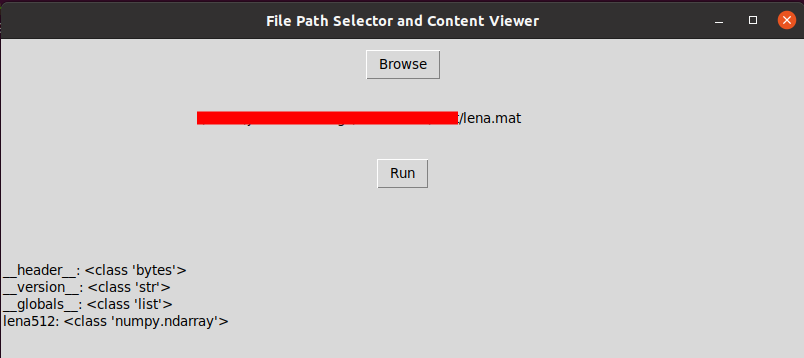

# File Path Selector and Content Viewer

This project provides a simple graphical user interface (GUI) built using **Tkinter** that allows the user to browse and select a `.mat` file, load its contents, and display the keys and types of variables stored in the file.

## Features

- Browse and select `.mat` files using a file dialog.
- Display the full path of the selected file in the GUI.
- View the keys and their types from the `.mat` file (e.g., variable names and data types).
- Error handling to display appropriate messages if something goes wrong.

## Screenshot

Below is a screenshot of the application in action, showing the main interface where you can browse for and select a `.mat` file, and view its contents once loaded.



The window displays:
- A **Browse** button to select a `.mat` file from your system.
- The **path** of the selected file is shown in the label.
- The **Run** button loads the file and displays its content, such as the keys and types of the variables within the `.mat` file.

This interface allows for easy file selection and content inspection for `.mat` files.

## Requirements

This project uses the following Python libraries:

- `tkinter` (usually included with Python, so no need to install separately)
- `scipy` (for loading `.mat` files)

### Installing Dependencies

To install the required dependencies for the project, create a virtual environment and install the dependencies from the `requirements.txt` file:

```bash
# Create and activate a virtual environment (if not already created)
python3 -m venv env39
source env39/bin/activate  # On Windows, use `env39\Scripts\activate`

# Install the dependencies
pip3 install -r requirements.txt
```

## How to Use
1. Clone the repository or download the files to your local machine.
2. Activate the virtual environment (if not already activated).
3. Run the application:

```bash
python3 main.py
```

4. A window will appear with a "Browse" button to select a `.mat` file.
5. After selecting a file, click the "Run" button to load the contents of the file.
6. The keys and types of variables in the `.mat` file will be displayed in the window.

## Error Handling

- If you try to run the program without selecting a file, a warning will appear.
- If an error occurs while loading the file, an error message will be shown with details.

## License

This project is open-source and available under the MIT License.